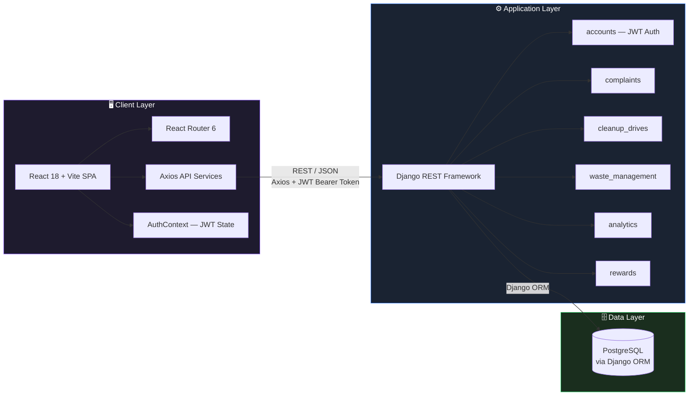
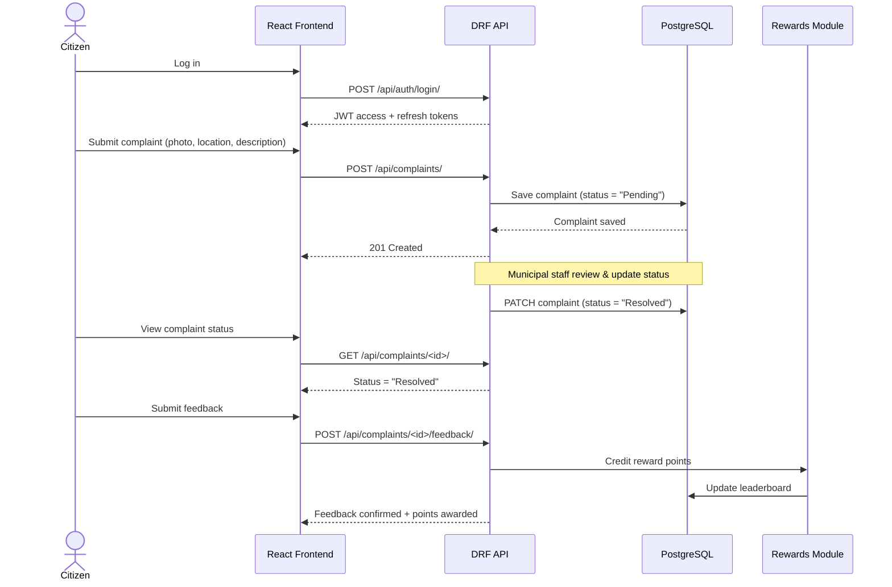
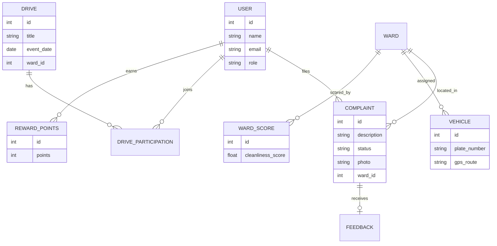

<div align="center">

# 🧹 SAFAI
### Swachhata Abhiyan Digital Platform

**"A click towards cleanliness."**

[](#-technology-stack)
[](#-technology-stack)
[](#-technology-stack)
[](#-postgresql-setup)
[]()

*A civic-tech platform for reporting cleanliness issues, organizing community cleanup drives, tracking sanitation performance, and rewarding citizen participation.*

</div>

---

## 📑 Table of Contents

- [Overview](#-overview)
- [System Architecture](#-system-architecture)
- [Core Workflow](#-core-workflow-complaint-lifecycle)
- [Data Model Overview](#-data-model-overview)
- [Team](#-student-team-members)
- [Technology Stack](#️-technology-stack)
- [Project Structure](#-project-structure)
- [PostgreSQL Setup](#️-postgresql-setup)
- [Backend Setup](#️-backend-setup-django)
- [Frontend Setup](#-frontend-setup-react--vite)
- [API Reference](#-key-api-endpoints)

---

## 🌆 Overview

SAFAI is a **dark-themed civic-tech digital platform** that empowers citizens and municipal bodies to collaborate on urban cleanliness. It is built as a **decoupled full-stack application** — a React single-page frontend consuming a Django REST Framework API backed by PostgreSQL.

**Core capabilities:**

| Module | What it does |
| :--- | :--- |
| 🗑️ **Complaints** | Citizens report cleanliness issues and track resolution status |
| 🤝 **Cleanup Drives** | Community members organize and join local cleanup events |
| 🚛 **Waste Management** | Municipal staff track vehicle fleets and ward coverage |
| 📊 **Analytics** | Public dashboards show ward-level scores and waste hotspots |
| 🏆 **Rewards** | Citizens earn points and climb a community leaderboard |

---

## 🏗️ System Architecture

SAFAI follows a clean three-tier architecture: a React SPA communicates with a Django REST API over JSON/HTTPS, which persists data in PostgreSQL.



---

## 🔄 Core Workflow: Complaint Lifecycle

A representative end-to-end flow — from a citizen filing a complaint to it being resolved and rewarded.



---

## 🧩 Data Model Overview

High-level relationships between the backend apps (each maps to a Django app / database domain).



---

## 👥 Student Team Members

| Member | Role | Responsibilities |
| :--- | :--- | :--- |
| **Prayash Ranjan Dash** | Frontend Developer | React.js architecture, UI components, responsive layout, dark theme design, forms, routing, and REST API integration |
| **Gyana Ranjan Kar** | Backend Developer | Django REST Framework backend, JWT authentication, RESTful endpoints, business logic for complaints, drives, vehicles, and rewards |
| **Isha Yadav** | Database, Integration & Project Support | PostgreSQL database design, Django ORM model relationships, backend–frontend integration, testing, documentation, and project coordination |

---

## 🛠️ Technology Stack

<table>
<tr>
<td valign="top" width="33%">

**Frontend**
- React 18
- Vite
- React Router 6
- Axios
- Tailwind CSS
- Lucide React Icons

</td>
<td valign="top" width="33%">

**Backend**
- Python 3.10+
- Django 4.2
- Django REST Framework
- SimpleJWT
- django-cors-headers
- Pillow

</td>
<td valign="top" width="33%">

**Database & Architecture**
- PostgreSQL
- Django ORM
- Decoupled SPA
- RESTful JSON APIs

</td>
</tr>
</table>

---

## 📁 Project Structure

```
safai-project/
├── backend/
│   ├── manage.py
│   ├── requirements.txt
│   ├── .env.example
│   ├── config/              # Django settings, urls, wsgi, asgi
│   ├── accounts/            # User model & JWT authentication APIs
│   ├── complaints/          # Complaint management & status tracking
│   ├── cleanup_drives/      # Community cleanup drive registrations
│   ├── waste_management/    # Vehicle fleet tracking & ward management
│   ├── analytics/           # Public stats, ward scores & hotspot analytics
│   └── rewards/             # Citizen reward points & community leaderboard
│
├── frontend/
│   ├── package.json
│   ├── vite.config.js
│   ├── tailwind.config.js
│   ├── index.html
│   └── src/
│       ├── components/      # Reusable dark theme UI components
│       ├── context/         # AuthContext state management
│       ├── services/        # Axios API services
│       └── pages/           # 14 complete application pages
│
└── README.md
```

---

## 🗄️ PostgreSQL Setup

1. Install PostgreSQL on your system.
2. Create a new database and user:

   ```sql
   CREATE DATABASE safai_db;
   CREATE USER postgres WITH PASSWORD 'your_password';
   GRANT ALL PRIVILEGES ON DATABASE safai_db TO postgres;
   ```

---

## ⚙️ Backend Setup (Django)

1. Navigate to the backend directory:

   ```bash
   cd backend
   ```

2. Create and activate a virtual environment:

   **Windows**
   ```cmd
   python -m venv venv
   venv\Scripts\activate
   ```

   **macOS / Linux**
   ```bash
   python3 -m venv venv
   source venv/bin/activate
   ```

3. Install dependencies:

   ```bash
   pip install -r requirements.txt
   ```

4. Configure environment variables by creating `.env` from `.env.example`:

   ```env
   SECRET_KEY=django-insecure-safai-super-secret-key
   DEBUG=True
   ALLOWED_HOSTS=localhost,127.0.0.1
   USE_POSTGRES=True
   DB_NAME=safai_db
   DB_USER=postgres
   DB_PASSWORD=your_password
   DB_HOST=localhost
   DB_PORT=5432
   ```

5. Apply database migrations:

   ```bash
   python manage.py makemigrations
   python manage.py migrate
   ```

6. Run the development server:

   ```bash
   python manage.py runserver
   ```

   The backend API will be running at **`http://localhost:8000/`**.

---

## 💻 Frontend Setup (React + Vite)

1. Navigate to the frontend directory:

   ```bash
   cd frontend
   ```

2. Install Node dependencies:

   ```bash
   npm install
   ```

3. Run the development server:

   ```bash
   npm run dev
   ```

   The application will be available at **`http://localhost:5173/`**.

---

## 📡 Key API Endpoints

### Authentication
| Method | Endpoint | Description |
| :--- | :--- | :--- |
| `POST` | `/api/auth/register/` | Register new user account |
| `POST` | `/api/auth/login/` | Obtain JWT access & refresh tokens |
| `GET` | `/api/auth/profile/` | Fetch current user profile |

### Complaints
| Method | Endpoint | Description |
| :--- | :--- | :--- |
| `GET / POST` | `/api/complaints/` | List or submit cleanliness complaints |
| `GET / PATCH` | `/api/complaints/<id>/` | View or update complaint status |
| `POST` | `/api/complaints/<id>/feedback/` | Submit feedback for a resolved complaint |

### Cleanup Drives
| Method | Endpoint | Description |
| :--- | :--- | :--- |
| `GET / POST` | `/api/drives/` | List or create cleanup drives |
| `POST` | `/api/drives/<id>/join/` | Join a community drive |

### Waste Management
| Method | Endpoint | Description |
| :--- | :--- | :--- |
| `GET` | `/api/vehicles/` | View vehicle fleet & GPS routes |

### Analytics
| Method | Endpoint | Description |
| :--- | :--- | :--- |
| `GET` | `/api/analytics/stats/` | Fetch platform public statistics |
| `GET` | `/api/analytics/hotspots/` | View waste hotspot risk analytics |

### Rewards
| Method | Endpoint | Description |
| :--- | :--- | :--- |
| `GET` | `/api/rewards/leaderboard/` | View community points leaderboard |

---

<div align="center">

*Built with 💚 for cleaner, smarter cities.*

</div>
